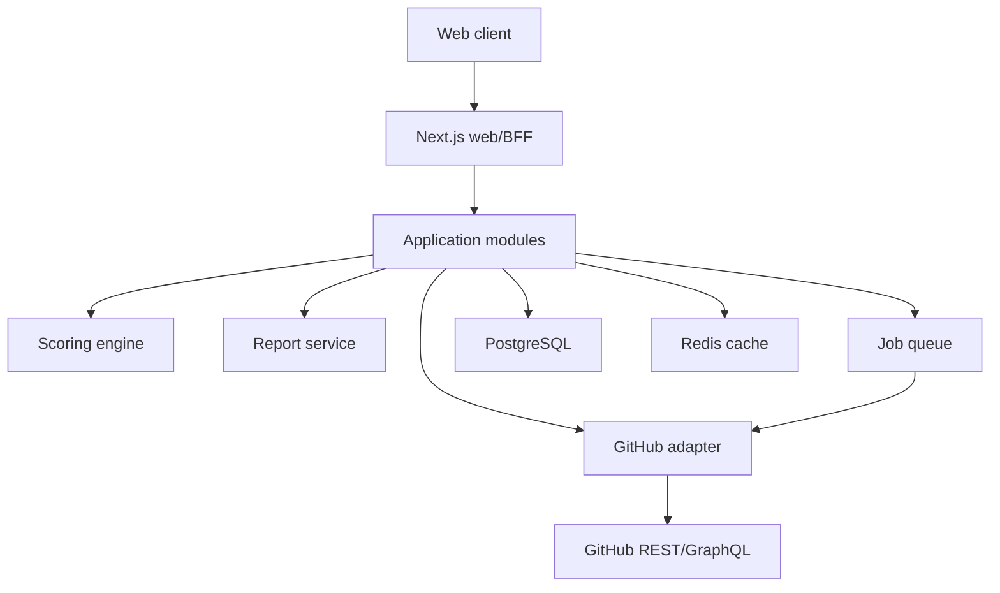

# System Architecture

## Decision
Start as a modular monolith. Keep domain boundaries explicit so workers or services can be extracted only when measurements justify it.



## Proposed repository structure
```text
apps/
  web/                 Next.js UI and server routes
  worker/              background refresh jobs
packages/
  domain/              entities, policies, use cases
  github-client/       GitHub API adapter and schemas
  scoring/             deterministic versioned scoring
  database/            schema, migrations, repositories
  observability/       logging, tracing, metrics
  config/              validated shared configuration
docs/                  product and engineering source of truth
tests/
  contract/             recorded/sanitized GitHub API contracts
  e2e/                  critical browser journeys
```

## Boundaries
- UI never calls GitHub directly with secrets.
- GitHub payloads are parsed into internal typed models.
- Scoring consumes stored evidence, not raw network responses.
- Reports include score-model and evidence versions.
- Background work is idempotent and retry-safe.
- External providers are adapters behind interfaces.

## Data flow
1. Validate URL and enforce allowlist.
2. Resolve issue and repository through GitHub.
3. Fetch bounded evidence with deadlines.
4. Normalize and persist evidence.
5. Run deterministic scoring.
6. Store immutable report snapshot.
7. Return presentation model.

## Deployment
MVP: web application, worker, managed PostgreSQL, managed Redis. CDN caches static assets. Secrets remain server-side. Environments are isolated: local, preview, staging, production.
