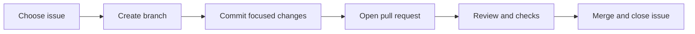

# Working with GitHub Issues and Pull Requests

This guide assumes you are contributing through GitHub for the first time.

## The four objects

| Object | Meaning |
| --- | --- |
| Issue | A clearly described problem or piece of work. |
| Branch | Your isolated copy of the code changes for one issue. |
| Commit | A saved, named checkpoint on that branch. |
| Pull Request | A request to review and merge the branch into `main`. |

The normal relationship is:



## 1. Choose the issue

Open the repository and select the **Issues** tab. For this project, start from the [MVP tracker](https://github.com/alaamadii/githubissuesSearching/issues/6).

Open an issue and confirm:

- the issue is open;
- it is not assigned to someone else;
- no linked open pull request already implements it;
- its dependencies are complete;
- you understand every acceptance criterion;
- the work fits inside one focused pull request.

For example, MVP-02 is not “build the whole product.” Its acceptance criteria define a shell, URL form, states, accessibility, and performance documentation. GitHub API integration belongs to later issues.

If anything is unclear, comment before coding:

> I would like to work on this. My understanding is that the PR will implement A and B, while C remains out of scope. Is that correct?

In your own repository, assign the issue to yourself when you begin. Assignment tells the team who is currently responsible; it does not mean the issue is finished.

## 2. Read the project rules

Before changing code, read:

- `README.md`;
- `CONTRIBUTING.md`;
- relevant files under `docs/`;
- existing tests and nearby code;
- the issue discussion and linked pull requests.

Also check the default branch and required checks. Never copy an old command from another project without confirming it applies here.

## 3. Update your local main branch

```bash
git switch main
git pull --ff-only origin main
```

`--ff-only` prevents Git from creating an accidental merge commit while updating your local branch.

## 4. Create one branch for the issue

Use a short name containing the issue or task:

```bash
git switch -c feat/mvp-02-app-shell
```

Common prefixes:

- `feat/`: user-facing feature;
- `fix/`: bug fix;
- `chore/`: tooling or maintenance;
- `docs/`: documentation only;
- `test/`: tests only.

Do not implement two unrelated issues on the same branch.

## 5. Understand before editing

Write a tiny plan from the acceptance criteria:

- files or modules likely to change;
- tests needed;
- explicit out-of-scope items;
- security and performance risks.

Search for existing patterns before creating a new component or helper. If another PR already touches the same files, coordinate first.

## 6. Make small, verifiable changes

After each coherent change:

```bash
git status
git diff
pnpm verify
```

Then commit:

```bash
git add <specific-files>
git commit -m "feat(web): add accessible issue URL form"
```

Prefer selecting specific files over `git add .` so accidental secrets or generated files are easier to notice.

Never commit:
- `.env` files;
- API keys or tokens;
- `node_modules`;
- logs containing private data;
- unrelated editor or operating-system files.

## 7. Push the branch

```bash
git push -u origin feat/mvp-02-app-shell
```

The `-u` option connects the local branch to its remote branch, so later `git push` is enough.

## 8. Open the pull request

On GitHub, use **Compare & pull request**, select:

- base: `main`;
- compare: your feature branch.

The PR should contain:

- a clear title;
- `Closes #8` when the PR fully completes issue 8;
- what changed and why;
- screenshots for UI changes;
- tests and commands run;
- accessibility evidence;
- security and performance impact;
- known limitations.

Open a **Draft PR** if the implementation or checks are incomplete. Mark it ready only when it is genuinely reviewable.

## 9. Read checks and review

A green check means a specific automated job passed—not that the entire product is perfect. Open each failed job and find the first meaningful error.

When review requests changes:

1. make the correction on the same branch;
2. rerun the relevant tests;
3. commit and push;
4. reply with what changed;
5. resolve the conversation only after the concern is addressed.

Do not open a second PR for ordinary review fixes.

## 10. Merge and close

Merge only when:

- every acceptance criterion is met;
- required checks pass;
- requested changes are resolved;
- no secrets or unrelated files are present;
- documentation matches the implementation.

If the PR body contains `Closes #8`, GitHub closes issue 8 automatically when the PR is merged into the default branch.

After merge:

```bash
git switch main
git pull --ff-only origin main
git branch -d feat/mvp-02-app-shell
```

The remote branch may also be deleted after merge.

## How to know what to work on now

Use this order:

1. Open the MVP tracker.
2. Find the first unchecked issue whose dependencies are finished.
3. Ensure no existing open PR covers it.
4. Assign it to yourself.
5. Restate its scope in your own words.
6. Create the branch.
7. Open a draft PR early.
8. Implement only its acceptance criteria.

For the current project:

- MVP-01 is being implemented in draft PR #22.
- MVP-02 should not be merged before MVP-01 is complete because it depends on the workspace foundation.
- You may read and refine MVP-02 now, but production code should branch from the updated `main` after MVP-01 merges.

## Quick example

Issue: **MVP-02: Create the accessible Next.js application shell**

Your interpretation:

- Build the shell and initial form.
- Show empty, invalid, loading, and error states.
- Make it keyboard accessible and responsive.
- Do not call GitHub yet.
- Do not add authentication, database, or scoring.

Branch:

```text
feat/mvp-02-app-shell
```

PR title:

```text
feat(web): create accessible application shell
```

PR body begins:

```text
Closes #8

Implements the responsive application shell and local issue URL form states.
Real GitHub integration remains out of scope and will be implemented in MVP-05.
```

That is the complete GitHub unit of work: one issue, one branch, focused commits, one pull request, reviewed checks, then merge.
